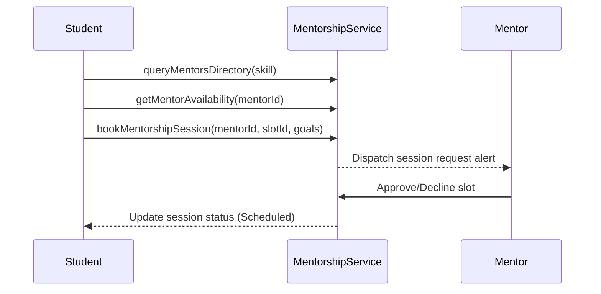

# Mentorship Module Architecture

This document describes the mentorship booking platform engine connecting students, employees, and industry experts.

---

## 1. Booking Workflow Lifecycles

---

## 2. Shared Availability Calendars

Mentors and industry experts utilize the unified `AvailabilityCalendar` to publish date slots, while candidates select active slots using the `BookingCalendar` component.
- Supports goals notes input.
- Real-time slot bookings block concurrent selection.

---

## 3. Ratings & Credentials Reviews

Completed sessions prompt reviews evaluations.
- Students submit stars ratings and reviews text through `submitMentorReview()`.
- Verified review indexes update the mentor rating benchmarks.
